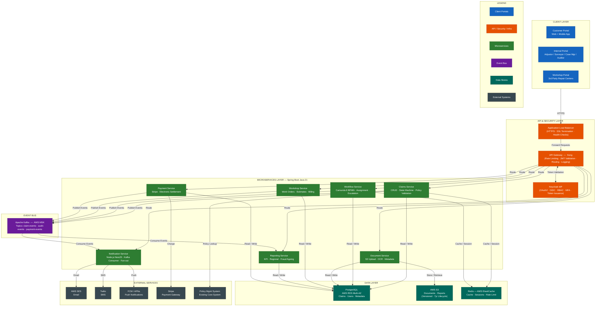
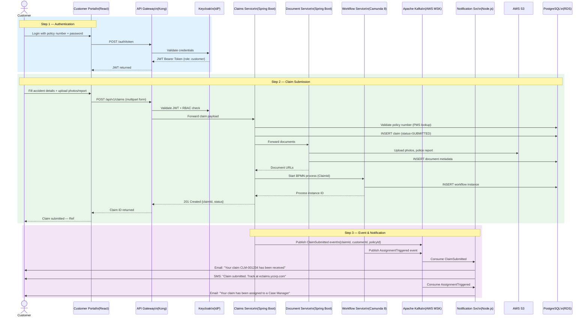
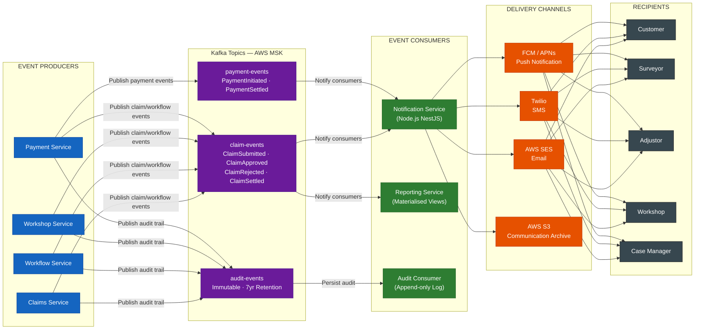
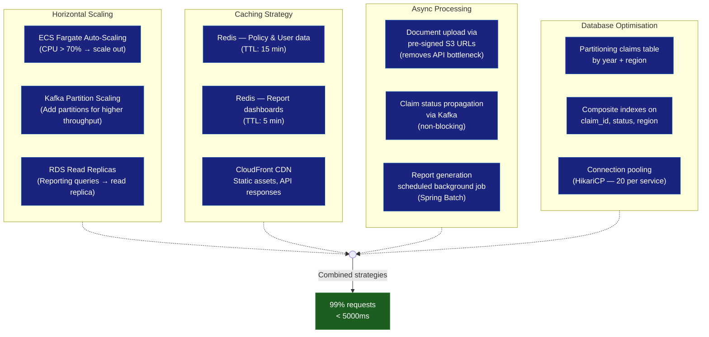
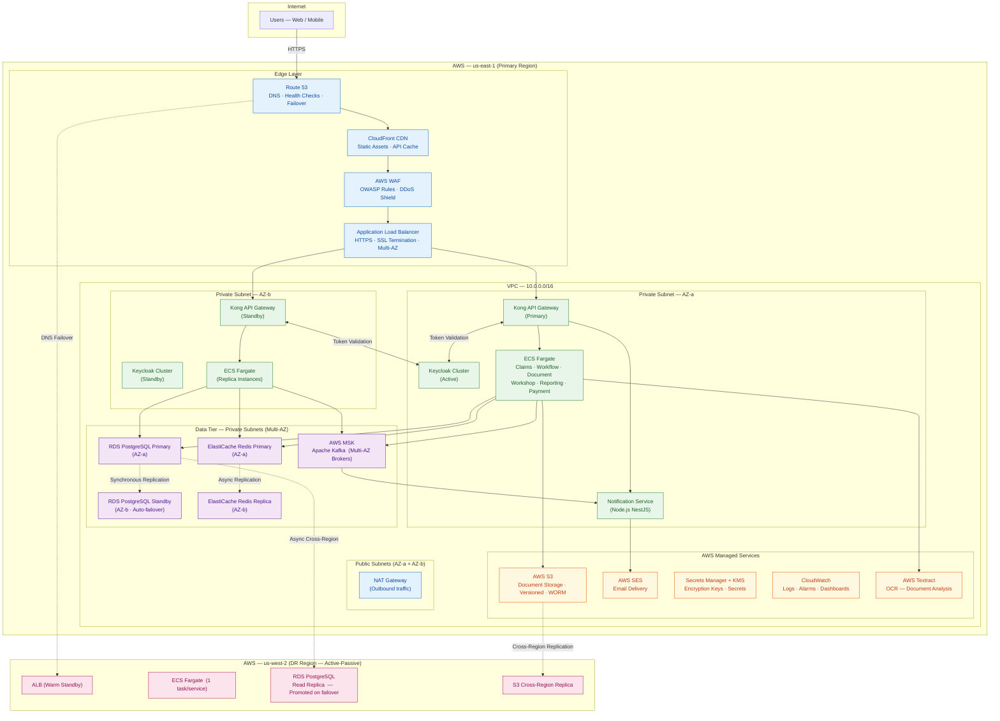

# eClaims System – Solution Approach Document

| Field       | Value                                          |
|-------------|------------------------------------------------|
| Version     | 1.0                                            |
| Date        | April 28, 2026                                 |
| Status      | Draft                                          |
| Prepared by | Senior Staff Engineer                          |
| Prepared for | YCompany – Claims Modernisation Programme     |

---

## Table of Contents

1. [Executive Summary](#1-executive-summary)
2. [Assumptions](#2-assumptions)
3. [Scope Definition](#3-scope-definition)
4. [Non-Functional Requirements](#4-non-functional-requirements)
5. [Solution Architecture](#5-solution-architecture)
   - 5.1 Architecture Principles
   - 5.2 High-Level System Architecture
   - 5.3 Multi-Layer Architecture
   - 5.4 Microservices Design
   - 5.5 Claims Lifecycle State Machine
   - 5.6 Data Flow – Claims Submission
   - 5.7 Notification & Event Flow
6. [Technology Stack](#6-technology-stack)
7. [Performance & Scalability](#7-performance--scalability)
8. [Security Architecture](#8-security-architecture)
9. [Deployment Architecture (AWS)](#9-deployment-architecture-aws)
10. [CI/CD Architecture](#10-cicd-architecture)
11. [Disaster Recovery](#11-disaster-recovery)
12. [References / Appendix](#12-references--appendix)

---

## 1. Executive Summary

### 1.1 Problem Statement

YCompany, a leading US auto insurance provider serving **200+ million customers**, relies entirely on a manual claims processing workflow. This results in:

- Long claim settlement cycles with no real-time customer visibility
- Manual paper-based assessments from field adjustors and surveyors
- No electronic payment capability (cheque-only settlement)
- No analytics or management reporting on claims performance
- Third-party workshop delays due to offline approval and payment processes
- Inability to detect or report fraudulent claims

### 1.2 Proposed Solution

**eClaims** is a cloud-native, microservices-based digital claims management platform consisting of:

| Portal | Audience |
|--------|----------|
| Customer Portal (Web + Mobile) | Policyholders – submit claims, track status, pay dues |
| Internal Portal | Case Managers, Surveyors, Adjustors, Auditors, Reporting Mgmt |
| Workshop Portal | Partner repair workshops – work orders, status updates, payment tracking |

### 1.3 Key Highlights

- **Event-driven architecture** — Apache Kafka as the durable event backbone for audit, replay, and multi-consumer fan-out
- **Spring Boot (Java 21)** microservices for core domain logic, Camunda 8 BPMN for claims workflow orchestration
- **Keycloak IdP** for standards-based RBAC across 8 roles, configurable without code changes
- **AWS cloud deployment** with on-prem option via containerisation (Docker/ECS/Kubernetes)
- **99%+ of requests completed in < 5000ms** across peak and off-peak hours
- **24×7 availability** with multi-AZ deployment, circuit breakers, and auto-scaling
- **7-year document archival** on AWS S3 with immutable audit logs for compliance

---

## 2. Assumptions

### Infrastructure
- AWS is the primary cloud provider (primary region: `us-east-1`, DR: `us-west-2`)
- On-prem deployment supported via containerised workloads (Docker + Kubernetes)
- Minimum 10 Mbps internet for web users; 3G or better for mobile
- Infrastructure provisioned as code via Terraform

### Business / Domain
- All existing policy data resides in a Policy Management System (PMS) accessible via API
- Customer identity is verified against their existing policy number
- Partner workshops are pre-registered entities; self-registration is out of scope
- Rental vehicle booking integration is a Phase 2 feature (stubs built in Phase 1)
- Fraud detection is rule-based in Phase 1; ML-based scoring is Phase 2
- All monetary values in USD; multi-currency is out of scope

### Security & Compliance
- System must comply with OWASP Top 10 and applicable US insurance data regulations
- Sensitive data (SSN, bank details, medical info) encrypted at rest using AES-256
- All claim documents retained for 7 years per compliance requirements
- SSO with enterprise AD is Phase 2; email/password + MFA in Phase 1

### Data
- Average claim record (metadata): ~20 KB
- Average supporting document (photos, police report): ~5 MB per claim
- Estimated daily new claims: ~50,000 peak
- Data retention: 7 years active claims, 3 years audit logs

---

## 3. Scope Definition

### 3.1 In Scope

#### Customer Portal (Web + Mobile)
- Registration / login using existing policy details
- Submit new claim with photos, police report, accident details
- Track real-time claim status
- Change correspondence address and billing cycle
- Select partner workshop; book appointment from portal
- Select rental vehicle from partner (stub – Phase 1)
- View repair progress via workshop work order updates
- Receive email/SMS/push notifications on all status changes
- Make electronic payment for repair dues

#### Incident Management
- Auto-assignment of Case Manager, Surveyor, Adjustor based on availability and region
- Surveyor: submit field assessment via web/mobile
- Adjustor: view claims, documents, assessment; adjudicate claim
- Case Manager: delegate, override, view full case details
- Auditor: read-only access to all claims and processing history

#### Workshop Portal
- View assigned claims and initial accident details
- Submit detailed work orders and repair estimates
- Update repair status (with customer auto-notification)
- Provide final bill for customer payment
- Track payment status per claim

#### Internal Reporting
- Case Manager: claims processed per region
- Regional Manager: claims volume, processing time, payout by region
- Top Management: cross-region performance, KPIs, fraud flags
- Export reports: PDF and Excel

#### Document Management
- Centralised DMS (AWS S3) for all claim documents
- Metadata indexed in PostgreSQL
- Immutable storage with versioning; 7-year lifecycle policy

#### Alerts & Notifications
- Email (AWS SES), SMS (Twilio), Push (FCM/APNs) for all status changes
- All customer communications archived to DMS for compliance

### 3.2 Out of Scope

- New policy issuance or policy management
- Rental vehicle booking (Phase 2 — stub only in Phase 1)
- ML-based fraud detection (Phase 2 — rule engine in Phase 1)
- Multi-currency or multi-language support
- Partner workshop self-registration
- Enterprise SSO / Active Directory integration (Phase 2)
- Actuarial or underwriting functions
- Mobile biometric authentication (Phase 2)

---

## 4. Non-Functional Requirements

> **See standalone NFR Summary: [q1-nfr-summary.md](./q1-nfr-summary.md)**

---

## 5. Solution Architecture

### 5.1 Architecture Principles

| Principle | Applied As |
|-----------|-----------|
| Design for Evolution | Loosely coupled microservices with versioned APIs |
| Componentise as Services | One service per bounded domain context |
| Event-Driven | Kafka events for all claim state changes |
| 24×7 Resilience | Circuit breakers, retries, health probes, multi-AZ |
| Security by Design | Zero-trust, mTLS between services, Keycloak IdP |
| Auditability | Immutable Kafka event log + append-only audit table |
| Observable | Centralized logging (ELK), metrics (Prometheus/Grafana), tracing (Jaeger) |

---

### 5.2 High-Level System Architecture

---

### 5.3 Multi-Layer Architecture

```mermaid
%%{init: {"theme": "default"}}%%
flowchart TB
    classDef layer1 fill:#E3F2FD,stroke:#1565C0,color:#0D47A1
    classDef layer2 fill:#FFF8E1,stroke:#F57F17,color:#E65100
    classDef layer3 fill:#E8F5E9,stroke:#2E7D32,color:#1B5E20
    classDef layer4 fill:#F3E5F5,stroke:#6A1B9A,color:#4A148C
    classDef layer5 fill:#E0F2F1,stroke:#00695C,color:#004D40
    classDef layer6 fill:#FCE4EC,stroke:#AD1457,color:#880E4F

    subgraph L1["LAYER 1 — PRESENTATION"]
        direction LR
        A1["React Web\n(TypeScript)"]
        A2["React Native\n(Mobile iOS + Android)"]
        A3["Internal Web\n(Admin / Reports)"]
    end

    subgraph L2["LAYER 2 — API & SECURITY"]
        direction LR
        B0["Application Load Balancer\n- HTTPS Termination\n- Health-based Routing\n- Multi-AZ Failover"]
        B1["Kong API Gateway\n- Rate Limiting\n- JWT Validation\n- Routing / Logging"]
        B2["Keycloak IdP\n- OAuth2 / OIDC\n- RBAC (8 Roles)\n- MFA · Token Issuance"]
    end

    subgraph L3["LAYER 3 — BUSINESS SERVICES"]
        direction LR
        C1["Claims\nService"]
        C2["Workflow\nService\n(Camunda)"]
        C3["Document\nService"]
        C4["Workshop\nService"]
        C5["Reporting\nService"]
        C6["Payment\nService"]
        C7["Notification\nService\n(Node.js)"]
    end

    subgraph L4["LAYER 4 — MESSAGING"]
        D1["Apache Kafka (AWS MSK)\nTopics: claim-events / notifications / audit / payments"]
    end

    subgraph L5["LAYER 5 — DATA"]
        direction LR
        E1["PostgreSQL\n(RDS Multi-AZ)\nPrimary Store"]
        E2["AWS S3\nDocument Store"]
        E3["Redis\n(ElastiCache)\nCache & Sessions"]
    end

    subgraph L6["LAYER 6 — INFRASTRUCTURE & OBSERVABILITY"]
        direction LR
        F1["AWS ECS Fargate\nContainer Orchestration"]
        F2["ELK Stack\nCentralised Logs"]
        F3["Prometheus\n+ Grafana\nMetrics"]
        F4["AWS CloudWatch\nAlarms & Alerts"]
        F5["Terraform\nInfra as Code"]
    end

    L1 -->|HTTPS| L2
    L2 -->|Authenticated Requests| L3
    L3 -->|Events| L4
    L4 -->|Event Consumption| L3
    L3 -->|Reads / Writes| L5
    L3 & L5 -.->|Logs / Metrics| L6

    class A1,A2,A3 layer1
    class B0,B1,B2 layer2
    class C1,C2,C3,C4,C5,C6,C7 layer3
    class D1 layer4
    class E1,E2,E3 layer5
    class F1,F2,F3,F4,F5 layer6
```

---

### 5.4 Microservices Design

| Service | Technology | Responsibility | Owns Data |
|---------|-----------|----------------|-----------|
| **Claims Service** | Spring Boot Java 21 | Claim CRUD, state machine, policy validation | `claims`, `claim_history` |
| **Workflow Service** | Spring Boot + Camunda 8 | BPMN process orchestration, auto-assignment, escalation timers | `workflow_instances` |
| **Document Service** | Spring Boot Java 21 | Upload/retrieve/archive documents, S3 integration, Textract OCR | `documents` |
| **Workshop Service** | Spring Boot Java 21 | Work orders, estimates, repair status, workshop payments | `workshops`, `work_orders` |
| **Reporting Service** | Spring Boot Java 21 | KPI dashboards, fraud ageing, regional reports, PDF/Excel export | `report_cache` (read replicas) |
| **Payment Service** | Spring Boot Java 21 | Customer payment processing, workshop payment settlement, Stripe integration | `payments` |
| **Notification Service** | Node.js NestJS | Kafka consumer, fan-out to SES/Twilio/FCM, archive communications | `notification_log` |

**Service Communication:**
- **Synchronous**: REST over HTTPS for user-initiated requests
- **Asynchronous**: Kafka events for all state change propagation
- **Service-to-Service**: Internal REST calls with circuit breaker (Resilience4j)

---

### 5.5 Claims Lifecycle State Machine

```mermaid
%%{init: {"theme": "default"}}%%
stateDiagram-v2
    direction LR

    [*] --> Draft : Customer begins claim

    Draft --> Submitted : Customer submits\nwith documents

    Submitted --> Assigned : System auto-assigns\nCase Mgr · Surveyor · Adjuster\n(by region & availability)

    Assigned --> UnderSurvey : Surveyor visits\nvehicle at workshop

    UnderSurvey --> AssessmentSubmitted : Surveyor uploads\ndamage assessment report

    AssessmentSubmitted --> UnderAdjudication : Adjuster notified;\nreviews policy coverage

    UnderAdjudication --> Approved : Adjuster approves\nclaim amount

    UnderAdjudication --> Rejected : Claim rejected\n(policy exclusion / fraud flag)

    Approved --> InRepair : Customer & Workshop\nnotified of approval

    InRepair --> RepairComplete : Workshop marks\nrepair as complete

    RepairComplete --> PaymentPending : Final bill raised;\ncustomer notified

    PaymentPending --> Settled : Customer pays\nelectronically

    Settled --> Archived : Documents archived\nto DMS; claim closed

    Rejected --> Archived : Rejection documented\nand archived

    Archived --> [*]

    note right of Assigned
        Kafka Event: ClaimAssigned
        Notifies: Surveyor (SMS + Email)
        SLA Timer: 24 hrs for survey
    end note

    note right of Approved
        Kafka Event: ClaimApproved
        Notifies: Customer + Workshop
        Camunda timer: escalation if no repair update in 48 hrs
    end note
```

---

### 5.6 Data Flow – Claims Submission

---

### 5.7 Notification & Event Flow

---

## 6. Technology Stack

| Layer | Component | Technology | Rationale |
|-------|-----------|-----------|-----------|
| Presentation | Web Portal | React 18 + TypeScript | Large ecosystem, strong typing, component reuse |
| Presentation | Mobile App | React Native | Cross-platform (iOS/Android), code reuse with web |
| API Security | Identity Provider | Keycloak 24 | Configurable RBAC without code changes; on-prem support; issues JWTs |
| API Security | Token Format | JWT (OAuth2 Bearer) | Stateless, short-lived, validated by each service |
| API Layer | API Gateway | Kong (self-hosted on ECS) | Flexible, cost-effective, plugin ecosystem |
| Core Backend | All business services | Spring Boot 3.x (Java 21) | Enterprise maturity, Camunda integration, Drools, compile-time safety |
| Workflow | BPMN Orchestration | Camunda 8 | Visual BPMN; self-hosted option for on-prem NFR; Spring Boot starter |
| Notification | Fan-out service | Node.js 20 + NestJS | Stateless, I/O-heavy event consumer; ideal for async delivery |
| Messaging | Event backbone | Apache Kafka (AWS MSK) | Durable event log, audit trail, replay, multi-consumer |
| Task Queues | Ephemeral jobs | AWS SQS | PDF generation, email dispatch — simple managed queue |
| Database | Primary datastore | PostgreSQL 16 (AWS RDS Multi-AZ) | ACID transactions, strong consistency for claims |
| Document Store | File storage | AWS S3 + AWS Textract | Scalable, versioned, lifecycle policies, OCR for uploads |
| Cache | Session & API cache | Redis 7 (AWS ElastiCache) | Rate limiting, session store, notification dedup |
| Notifications | Email | AWS SES | Reliable, archivable, high throughput |
| Notifications | SMS | Twilio | Global reach, delivery receipts |
| Notifications | Push | Firebase FCM + APNs | Cross-platform mobile push |
| Payments | Gateway | Stripe | PCI-DSS compliant, easy integration |
| Observability | Metrics | Prometheus + Grafana | Real-time dashboards, alerting |
| Observability | Logging | ELK Stack (Elasticsearch + Logstash + Kibana) | Centralised logs with correlation IDs |
| Observability | Tracing | Jaeger (OpenTelemetry) | Distributed trace for microservices debugging |
| Infra | Container Orchestration | AWS ECS Fargate | Serverless containers, no EC2 management |
| Infra | IaC | Terraform | Reproducible infra across environments |
| CI/CD | Pipeline | GitHub Actions | Native YAML, rich marketplace, secrets management |

---

## 7. Performance & Scalability

### 7.1 Performance Targets

| Metric | Target | Strategy |
|--------|--------|---------|
| API Response Time | 99% < 5000ms (peak & off-peak) | CDN, Redis cache, async claim processing |
| Claim Submission | < 3000ms (p95) | Async document upload (pre-signed S3 URLs) |
| Dashboard Load | < 2000ms | Pre-aggregated report views, Redis cache |
| Notification Delivery | < 30s after status change | Kafka consumer lag monitoring, partition scaling |
| Document Upload | < 5000ms per file | Direct-to-S3 pre-signed URL, parallel multipart |

### 7.2 Scalability Strategy

---

## 8. Security Architecture

### 8.1 Security Layers

| Layer | Control | Implementation |
|-------|---------|---------------|
| Edge | DDoS protection | AWS Shield Standard + WAF (OWASP rule groups) |
| Transport | Encryption in transit | TLS 1.3 for all external and internal communications |
| Identity | Authentication | Keycloak — email/password + MFA (TOTP) |
| Identity | Authorisation | JWT-based RBAC; role claims validated per service |
| Data | Encryption at rest | AES-256 (RDS encrypted volumes, S3 SSE-KMS) |
| Data | PII protection | Field-level encryption for SSN, bank account details |
| API | Rate limiting | Kong rate-limit plugin (per user, per IP) |
| API | Input validation | Spring Validation (Bean Validation 3.0) on all DTOs |
| Audit | No-repudiation | Kafka `audit-events` topic — append-only, 7yr retention |
| Audit | User action log | Every write operation logged with userId, timestamp, payload hash |
| Fraud | Detection | Rule-based engine (claim amount anomalies, duplicate incidents, suspicious patterns) |
| Secrets | Key management | AWS Secrets Manager + KMS; no secrets in codebase |
| Dependency | Vulnerability scan | OWASP Dependency-Check in CI/CD pipeline |

### 8.2 RBAC Matrix

| Role | Claims | Documents | Assessment | Adjudication | Reports | Workshop | Override |
|------|--------|-----------|-----------|-------------|---------|---------|---------|
| Customer | Own only | Own only | View | — | — | View status | — |
| Surveyor | Assigned | Assigned | Submit | — | — | — | — |
| Adjustor | Assigned | Assigned | View | Submit | — | View | — |
| Case Manager | All | All | View | View | Regional | View | Yes |
| Auditor | All | All | View | View | All | View | — |
| Workshop | Linked | Linked | — | — | Own billing | Submit | — |
| Regional Mgr | Regional | — | — | — | Regional | — | — |
| Top Management | — | — | — | — | All | — | — |

---

## 9. Deployment Architecture (AWS)

---

## 10. CI/CD Architecture

```mermaid
%%{init: {"theme": "default"}}%%
flowchart LR
    classDef trigger  fill:#1565C0,stroke:#0D47A1,color:#fff
    classDef build    fill:#2E7D32,stroke:#1B5E20,color:#fff
    classDef test     fill:#F57F17,stroke:#E65100,color:#fff
    classDef security fill:#AD1457,stroke:#880E4F,color:#fff
    classDef deploy   fill:#6A1B9A,stroke:#4A148C,color:#fff
    classDef env      fill:#00695C,stroke:#004D40,color:#fff

    subgraph SOURCE["  Source  "]
        GH["GitHub\nFeature Branch\n→ PR → main"]
    end

    subgraph BUILD["  Build  "]
        COMPILE["Maven Build\n(Java 21)\nCompile + Package"]
        DOCKER["Docker Build\nMulti-stage\nimage"]
        ECR["Push to\nAWS ECR\n(tagged)"]
    end

    subgraph TEST["  Test  "]
        UT["Unit Tests\n(JUnit 5\n+ Mockito)"]
        IT["Integration Tests\n(Testcontainers\nPostgres + Kafka)"]
        E2E["E2E Tests\n(Playwright\nCustomer flow)"]
        COV["Code Coverage\n(JaCoCo ≥ 80%)"]
    end

    subgraph SECURITY["  Security Scan  "]
        SAST["SAST\n(SonarQube)"]
        DEP["Dependency\nCheck\n(OWASP)"]
        IMG["Container\nScan\n(Trivy)"]
    end

    subgraph DEPLOY["  Deploy  "]
        DEV["Deploy → DEV\n(auto on PR merge)"]
        STG["Deploy → STAGING\n(blue-green\nauto-smoke test)"]
        PROD["Deploy → PROD\n(blue-green\nmanual gate)"]
    end

    subgraph POSTDEPLOY["  Post-Deploy  "]
        SMOKE["Smoke Tests\n(health checks)"]
        ROLL["Auto-Rollback\nif health fails"]
        NOTIFY_CD["Slack / Email\nDeploy Notification"]
    end

    GH       -->|Push / PR trigger — GitHub Actions| COMPILE
    COMPILE  --> DOCKER --> ECR
    COMPILE  --> UT --> IT --> E2E --> COV
    ECR      --> GATE((" "))
    COV      --> GATE
    GATE     --> SAST --> DEP --> IMG
    IMG      -->|All gates pass| DEV
    DEV      -->|Promote| STG
    STG      -->|Manual approval| PROD
    PROD     --> SMOKE
    SMOKE    -->|Pass| NOTIFY_CD
    SMOKE    -->|Fail| ROLL

    class GH trigger
    class COMPILE,DOCKER,ECR build
    class UT,IT,E2E,COV test
    class SAST,DEP,IMG security
    class DEV,STG,PROD deploy
    class SMOKE,ROLL,NOTIFY_CD env
```

---

## 11. Disaster Recovery

### 11.1 DR Targets

| Metric | Target | Mechanism |
|--------|--------|---------|
| Recovery Time Objective (RTO) | < 1 hour | Automated DNS failover (Route 53), warm standby ECS in DR region |
| Recovery Point Objective (RPO) | < 15 minutes | RDS async cross-region replication (≈5 min lag), MSK mirroring |
| Backup Frequency | Daily full + hourly incremental | AWS Backup automated policy |
| Backup Retention | 30 days online; 7 years archived (S3 Glacier) | S3 lifecycle + AWS Backup vault |
| Document Retention | 7 years (compliance) | S3 Versioning + Object Lock (WORM) |

### 11.2 DR Strategy

- **Active-Passive** across `us-east-1` (primary) and `us-west-2` (DR)
- RDS read replica in DR region promoted to primary on failover
- S3 Cross-Region Replication for all documents (RPO: seconds)
- Route 53 health checks with DNS failover (TTL: 60s)
- ECS task definitions maintained in DR; services scaled to 1 (warm) during normal ops
- Kafka MSK mirroring via MirrorMaker 2 to DR region

---

## 12. References / Appendix

| Item | Reference |
|------|-----------|
| OWASP Top 10 | https://owasp.org/Top10/ |
| Camunda 8 Documentation | https://docs.camunda.io |
| Apache Kafka Documentation | https://kafka.apache.org/documentation/ |
| Spring Boot 3.x Reference | https://docs.spring.io/spring-boot/docs/current/reference/html/ |
| Keycloak 24 Documentation | https://www.keycloak.org/documentation |
| AWS Well-Architected Framework | https://aws.amazon.com/architecture/well-architected/ |
| React 18 Documentation | https://react.dev |
| Terraform AWS Provider | https://registry.terraform.io/providers/hashicorp/aws/latest |
| HRMS Reference Architecture | https://github.com/piyush5989/nagp-architect-pathway-hrms |

### Appendix A – Diagram Source Files

All Mermaid diagram source code is embedded in this document.
To convert to Visio / draw.io:
1. Paste any Mermaid block at [mermaid.live](https://mermaid.live)
2. Export as SVG → import into draw.io or Visio

### Appendix B – Glossary

| Term | Definition |
|------|-----------|
| BPMN | Business Process Model and Notation – workflow definition standard |
| CQRS | Command Query Responsibility Segregation |
| DMS | Document Management System |
| IdP | Identity Provider |
| RBAC | Role-Based Access Control |
| RTO | Recovery Time Objective |
| RPO | Recovery Point Objective |
| WORM | Write Once Read Many – immutable storage policy |
| MSK | Amazon Managed Streaming for Kafka |
| ECS | Elastic Container Service |
| WAF | Web Application Firewall |
